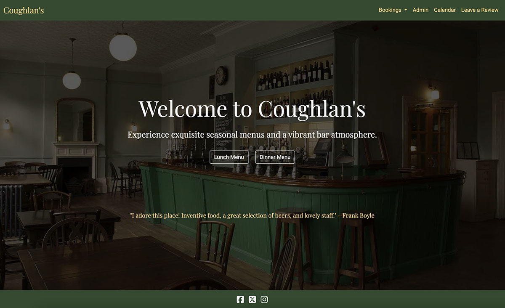
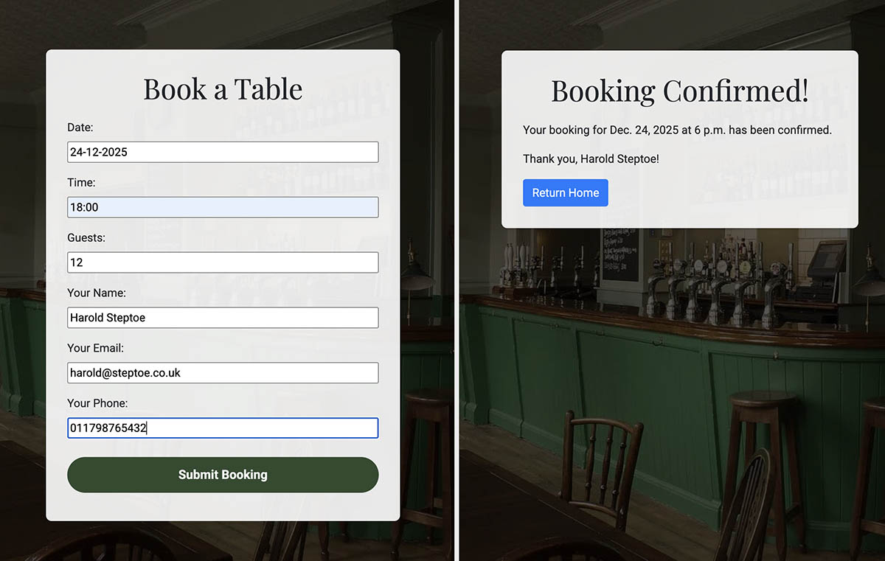
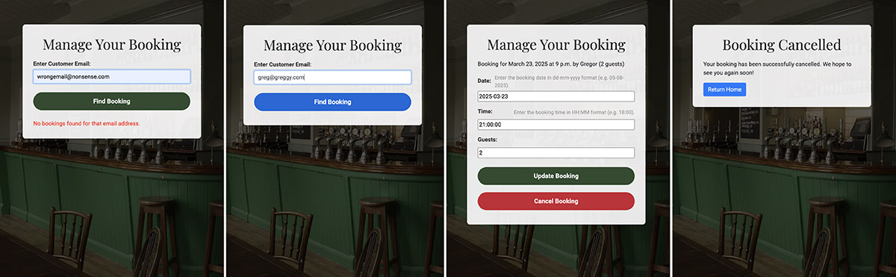
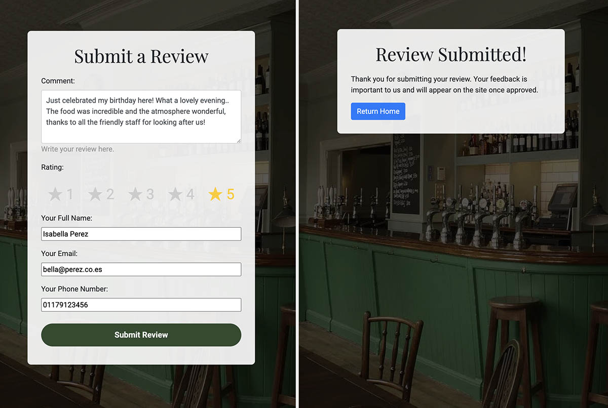
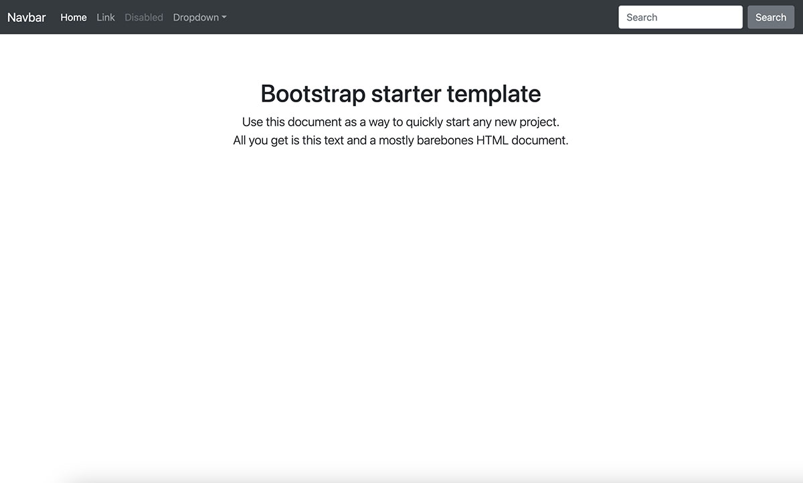
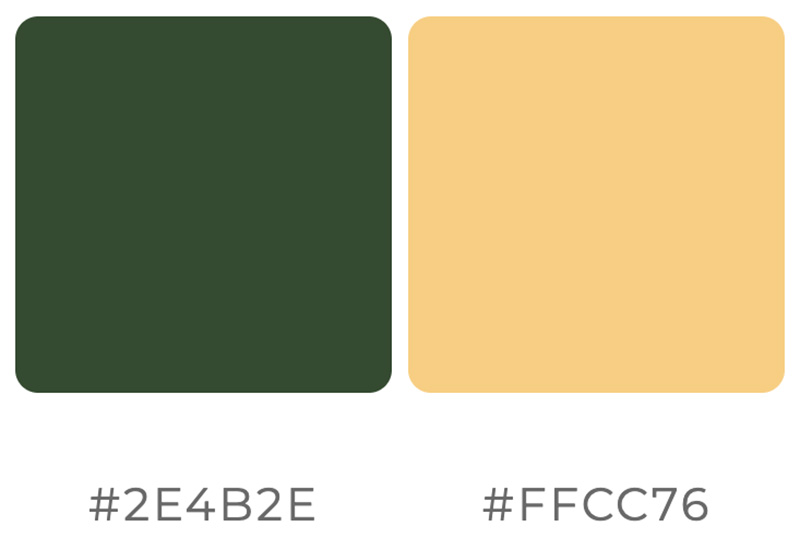

# Coughlan's Restuarant - Project Overview



**Coughlan's Restaurant** is a web application for a fictional restaurant that enables users to make and manage table bookings, submit reviews, and view current menus. The application is built using **Django**, **Python**, and **PostgreSQL**, with a responsive front-end styled using **Bootstrap** and custom CSS.

## Table of Contents
- [Features](#features)
- [Technologies Used](#technologies-used)
- [Design and Development Tools](#design-and-development-tools)
- [Setup and Installation](#setup-and-installation)
- [Usage Instructions](#usage-instructions)
  - [For Customers](#for-customers)
  - [For Staff--Admin](#for-staff--admin)
- [Testing](#testing)
- [Testing Table](#testing-table)
- [User Stories](#user-stories)
- [Visual Design](#visual-design)
- [Design Considerations](#design-considerations)
- [Entity Relationship Diagram (ERD)](#entity-relationship-diagram-erd)
- [Essential Future Improvements](#essential-future-improvements)
- [Other Future Improvements](#other-future-improvements)
- [References and Credits](#references-and-credits)
- [License](#license)
- [Acknowledgements](#acknowledgements)

## Features

- **Booking System:**
  - Users can easily book a table through an intuitive form.
  - A custom confirmation page is displayed upon successful booking.
  - Staff can manage bookings using dedicated views, including daily, weekly, and monthly calendar displays.

- **Review Submission:**
  - Customers can submit reviews using a star-based rating system.
  - Reviews are stored as numerical values and are displayed on the homepage once approved by an admin.

- **Menu Display:**
  - Static pages present the restaurant’s lunch and dinner menus.
  - Menus can be updated seasonally to reflect available dishes.

- **Admin & Staff Functionality:**
  - Staff have access to custom booking management interfaces directly from the website.
  - The application also leverages Django's admin panel for advanced management tasks.

*Screenshots and additional images can be added later to visually illustrate these features.*

## Technologies Used

[](https://developer.mozilla.org/en-US/docs/Web/Guide/HTML/HTML5)  
[](https://developer.mozilla.org/en-US/docs/Web/CSS)  
[](https://developer.mozilla.org/en-US/docs/Web/JavaScript)  
[](https://www.djangoproject.com/)  
[](https://www.python.org/)  
[](https://www.postgresql.org/)  
[](https://getbootstrap.com/)

*Notable Libraries:*  
- **dj_database_url** – For parsing the database URL.  
- **Gunicorn** – For running the application in production.

## Design and Development Tools

[](https://git-scm.com/)  
[](https://github.com/)  
[](https://code.visualstudio.com/)  
[](https://www.heroku.com/)  
[](https://www.adobe.com/products/photoshop.html)
[](https://fontawesome.com/)  
[](https://fonts.google.com/)


## Setup and Installation

1. **Clone the Repository:**
   ```bash
   git clone <repository_url>
   cd <repository_folder>
2. **Create and Activate a Virtual Environment:**
- On macOS/Linux:
    ```bash
    python3 -m venv venv
    source venv/bin/activate
- On Windows:
    ```bash
    python -m venv venv
    venv\Scripts\activate
3. **Install Dependencies:**
    ```bash
    pip install -r requirements.txt
4. **Configure Environment Variables:**
- Create a .env file in the project root and add:
    ```env
    SECRET_KEY=<your_secret_key>
    DATABASE_URL=<your_postgresql_database_url>
5. **Run Migrations**
    ```bash
    python manage.py migrate
6. **Collect Static Files** (Optional, for production deployments)
    ```bash
    python manage.py collectstatic --noinput
7. **Start the Development Server**
    ```bash
    python manage.py runserver

## Usage Instructions

### For Customers
- **View Menus:**  
  Visit the homepage to see the restaurant’s seasonal menus (Lunch and Dinner).

- **Book a Table:**  
  - Click on **"Make a Booking"** from the Bookings dropdown in the navigation.
  - Fill in your personal details (name, email, phone) and select the date, time, and number of guests.
  - Submit the form to receive a custom confirmation page with your booking details.



 - **Manage a Booking**  
  - Click on **"Manage Booking"** from the Bookings dropdown in the navigation.
  - Enter email associated with the booking
  - Submit the form to check for bookings made with that email.
  - Modify or Cancel existing booking.



- **Leave a Review:**  
  - Navigate to the **"Leave a Review"** page.
  - Submit your feedback using the star-based rating system and text field for your comment.
  - Your review will be pending approval before it appears on the homepage.



### For Staff / Admin
- **Admin Login:**  
  Staff members can log in via the **"Admin"** link to access Django’s built-in admin panel for advanced management tasks.

- **Manage Bookings via Calendar Views:**  
  - Click on **"Calendar"** (visible only to staff) in the navigation.
  - By default, the **Daily Calendar** view shows bookings for the current day.  
    Use navigation links to switch to Weekly or Monthly views.
  - In any calendar view, click the **"Manage"** link next to a booking to update or cancel it.
  - You can also search for a booking using the email-based lookup function.


## Testing

The project has been manually tested to ensure key functionalities work as expected. Below are the main test scenarios:

- **Booking System:**  
  - The booking form accepts valid input and redirects to a custom confirmation page.  
  - Error messages are displayed for invalid input.  
  - Bookings are correctly stored in the database and appear in the staff calendar views.

- **Review Submission:**  
  - The review form validates user input and uses a star rating system.  
  - Submitted reviews are stored as numerical ratings and appear in the admin panel for approval.  
  - Once approved, reviews display correctly on the homepage.

- **Calendar Views:**  
  - Daily, weekly, and monthly calendar views display bookings accurately.  
  - Navigation links (e.g., switching between daily and monthly views) function correctly.
  
*Note: Additional automated tests may be added in the future as the project evolves.*


## Testing Table

| Test Condition                                                                                       | Expected Outcome                                                                                                                  | Result   | Notes                                               |
|------------------------------------------------------------------------------------------------------|-----------------------------------------------------------------------------------------------------------------------------------|----------|-----------------------------------------------------|
| **Booking Form Valid Submission**                                                                    | When valid booking data is submitted, the user is redirected to a custom booking success page displaying booking details.         | Pass     |                                                     |
| **Booking Form Invalid Submission**                                                                  | With invalid input (e.g., wrong date format), the form fails validation and displays inline error messages without redirection.    | Pass     |                                                     |
| **Review Form Default Rating**                                                                       | The review form displays five stars with the default rating set to 5 (all stars highlighted in gold).                              | Fail     | Investigate CSS/JS to ensure all stars are pre-selected. |
| **Review Form Rating Adjustment**                                                                    | When a user selects a different star (e.g., 4), only that star and all lower-valued stars remain highlighted, and the correct value is submitted. | Fail     | Debug the star selection logic; consider JS adjustments.  |
| **Review Form Successful Submission**                                                                | Upon valid review submission, the user is redirected to a review success page acknowledging their feedback.                        | Pass     |                                                     |
| **Daily Calendar View Display**                                                                      | The daily calendar view accurately displays all bookings for the selected day with correct times and customer details.             | Pass     |                                                     |
| **Weekly Calendar View Display**                                                                     | The weekly calendar view lists bookings for each day correctly with functional "Manage" links.                                     | Pass     |                                                     |
| **Calendar Navigation**                                                                              | Navigation links between daily, weekly, and monthly views work correctly, updating the view without errors.                        | Pass     |                                                     |
| **Django Admin Access and Functionality**                                                            | Admin users can log in to the Django admin panel and access, add, modify, and delete Bookings, Reviews, and Customers.               | Pass |  |
| **Static File Serving**                                                                              | All static files (CSS, JS, images) load correctly across all pages without errors.                                               | Pass | |
| **Responsive Design**                                                                                | The website displays correctly on mobile, tablet, and desktop devices, ensuring a consistent user experience.                       | Pass | |
| **Performance Testing**                                                                              | The site loads within an acceptable time frame (< 3 seconds under normal conditions) and responds quickly to user interactions.   | Pass | Use browser dev tools to monitor load times and optimize if needed. |


## User Stories

- **As a customer, I can book a table so that I can secure a reservation at Coughlan's Restaurant.**  
  - *Acceptance Criteria:*
    - The booking form accepts valid input and displays a custom confirmation page.
    - Booking details are saved and can be retrieved by both the customer and staff.

- **As a customer, I can submit a review using a star-based rating system so that I can share my dining experience.**  
  - *Acceptance Criteria:*
    - The review form allows selection of a star rating and submission of a comment.
    - Reviews are stored with a numerical rating and are displayed on the homepage once approved.

- **As a staff member, I can manage bookings through calendar views so that I can update or cancel reservations efficiently.**  
  - *Acceptance Criteria:*
    - Staff can view bookings in daily, weekly, and monthly formats.
    - Each booking has a “Manage” option that lets staff update or cancel the booking without re-entering customer details.

- **As an admin, I can access the Django admin panel so that I can perform advanced management tasks and approve reviews.**  
  - *Acceptance Criteria:*
    - An Admin login link is available in the navigation for staff users.
    - Admins can approve or reject submitted reviews via the Django admin interface.

## Visual Design

Coughlan's Restaurant features a clean, elegant, and responsive design that reinforces a traditional yet modern dining experience. Key design elements include:

- **Minimal Bootstrap Theme**

  This project builds upon the [Bootstrap Starter Template](https://getbootstrap.com/docs/4.5/examples/starter-template/), a minimal and responsive foundation provided by Bootstrap.

  

  The Bootstrap Starter Template offers a lightweight, clean base that makes it easy to customize and integrate with custom CSS. Its minimal design ensures that the focus remains on the project's unique visual elements while maintaining fast load times and responsive behavior across all devices. This approach has allowed us to implement our custom styling and functionality (such as the booking forms and calendar views) while preserving the robust, mobile-first features of Bootstrap.

- **Color Scheme:**  
  A simple refined palette using a Dark Olive (#2e4b2e) for the header and footer and a Light Gold (#ffcc76) for the brand (homepage link) and navigation.

  This high-contrast combination ensures readability and visual impact.

  

- **Typography:**  
  Headings are styled with **Playfair Display** to evoke a classic, upscale feel, while body text uses **Roboto** for clarity and modernity.

  [Playfair Display](https://fonts.google.com/specimen/Playfair+Display/about)

  [Roboto] https://fonts.google.com/specimen/Roboto/about?query=Roboto

- **Imagery and Layout:**  
  Mention Bootstrap here

  The homepage uses a full-width hero image with a dark overlay, ensuring that the key call-to-action elements are clear and engaging. Consistent spacing and alignment across pages create a unified user experience.

- **Interactive Elements:**  
  Custom components, such as the star rating system for reviews and dynamic calendar views for booking management, have been designed to be both visually appealing and user-friendly.

*Include screenshots or design mockups as necessary to illustrate these elements.*


## Design Considerations

- **Framework & Architecture:**  
  - Built with Django to leverage its robust MVC architecture, ensuring a clean separation of concerns between models, views, and templates.
  
- **Modular App Structure:**  
  - The project is divided into two apps: `bookings` for reservation management and `reviews` for customer feedback, which keeps the code organized and scalable.
  
- **Responsive & Consistent Design:**  
  - Uses Bootstrap along with custom CSS (in `forms.css` and `calendar.css`) to provide a consistent and responsive user experience across desktop and mobile devices.
  
- **User-Friendly Features:**  
  - Implements intuitive features such as a star-based rating system for reviews, calendar views (daily, weekly, and monthly) for managing bookings, and an email-based lookup for bookings.
  
- **Deployment & Configuration:**  
  - Deployed on Heroku using a cloud-based PostgreSQL database, ensuring ease of scaling and secure management of environment variables.
  
*Future improvements include integrating user accounts and further enhancing the interactive elements of the star rating system.*

## Entity Relationship Diagram (ERD)

Below is the ERD that represents the main data relationships in the application:


### Explanation

- **Customer:**  
  - **Attributes:** Name, Email, Phone  
  - **Relationship:** A single Customer can have multiple Bookings and multiple Reviews. This one-to-many relationship ensures that customer information is stored only once and is reused across the booking and review functionalities.

- **Booking:**  
  - **Attributes:** Date, Time, Number of Guests  
  - **Relationship:** Each Booking is linked to one Customer, meaning a customer can make many bookings over time. This minimizes duplicate customer data.

- **Review:**  
  - **Attributes:** Comment, Rating, Approval Status, Created At  
  - **Relationship:** Each Review is linked to one Customer, allowing a customer to submit multiple reviews. The rating is stored as a numerical value even though it is presented as a star-based input.

This ERD illustrates how the **Customer** model serves as the central point, connecting the **Booking** and **Review** functionalities to maintain data consistency and avoid duplication.

## Essential Future Improvements

- **Booking Form:**  
  - Enable user to pick date and time from a 'calendar widget' or similar for improved user experience.
  - Use placeholder text for empty fields.
  - Style user input fields to minimize empty space.

- **Review Form:**
  Review stars not working as anticipated. All stars should be 'checked' by default. Currently only number 5 is. If a user selects a rating of 4 then 4 stars should be checked and so on, rather than the individual number. This could potentially be done by JavaScript.

- **All Forms:**
  A close button (cross) in corner so that the user can close the form. Currently the user has to click on home (Coughlan's) to navigate away from the form.

- **Menus:**
  Currently just a basic placeholder - add and style content.

## Other Future Improvements
  
- **Admin Calendar Views:**  
  Some extra styling here to bring in line with the site theme but still mainting functionality (key)

- **Mailing List**  
  A link on the site to sign up to a mailing list - a checkbox could also be included in the review form for this

- **User Account Management:**  
  Enable customers to create and manage accounts, view their booking history, and easily submit or update reviews.

- **Automated Testing:**  
  Develop a suite of unit and integration tests to further ensure the robustness of the booking and review functionalities.

- **Payment Integration:**  
  Integrate a secure payment gateway to handle deposits or full payments for table reservations.

- **Email Notifications:**  
  Implement automated email alerts for booking confirmations, cancellations, and review approvals.

- **UI/UX Enhancements:**  
  Further refine the responsive design and overall user experience based on ongoing feedback.

*Additional enhancements may be added as the project evolves.*

## References and Credits

- **Django Documentation:**  
  The official Django documentation was used extensively for best practices and guidance on building the project.  
  [Django Documentation](https://docs.djangoproject.com/)

- **Shields.io:**  
  Used to generate badges for the README to represent various technologies.  
  [Shields.io](https://shields.io/)

- **Bootstrap:**  
  The Bootstrap framework was used for responsive design and component styling.  
  [Bootstrap Official Site](https://getbootstrap.com/)

- **Star Rating Implementation:**  
  The approach for styling the star rating widget was inspired by community discussions and tutorials on Stack Overflow.  
  *Specific references:*  
  - [Stack Overflow: How to create a star rating system using CSS and JavaScript](https://stackoverflow.com/) *(search for "CSS star rating radio buttons")*  
  - Various online tutorials on customizing Django forms with CSS.

- **Heroku Deployment:**  
  The process of deploying Django applications to Heroku was guided by the official Heroku documentation and tutorials.  
  [Heroku Dev Center: Deploying Python and Django Apps](https://devcenter.heroku.com/categories/python-support)

- **Adobe Photoshop:**  
  Used for image editing and creating visual assets for the project.  
  [Adobe Photoshop](https://www.adobe.com/products/photoshop.html)

- **Hero Image Source:**  
  Used as the image in the homepage background
  [Adobe Photoshop](https://www.adobe.com/products/photoshop.html)

*Additional credits and resources may be added as the project evolves.*

## License

This project is licensed under the MIT License. See the [LICENSE](LICENSE) file for details.

## Acknowledgements

I would like to extend my sincere thanks to everyone who supported me throughout this project:

- **My Tutor at WAES, Komal Karir:** For invaluable guidance and encouragement.
- **My Code Institite Mentor, Spencer Barribal:** For your insights and support.
- **My Fellow L5 Web Application Development Students:** For your collaboration and feedback.